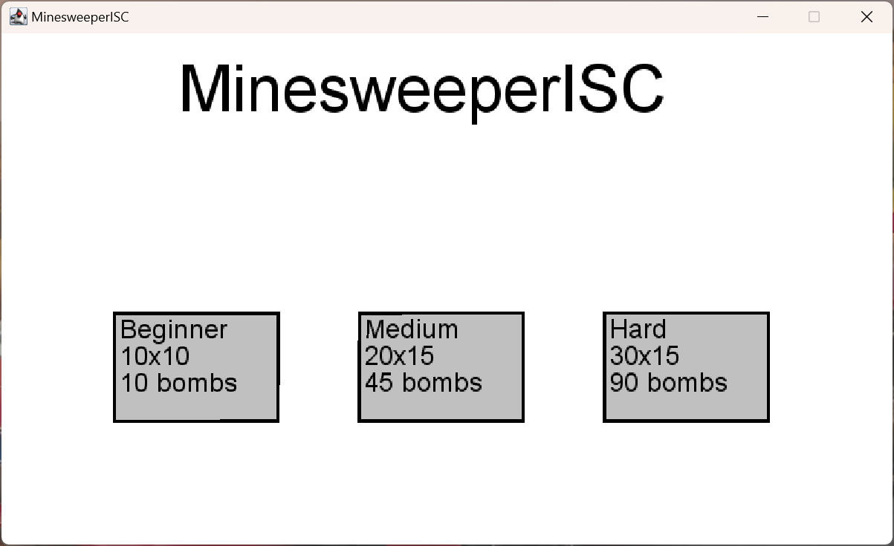
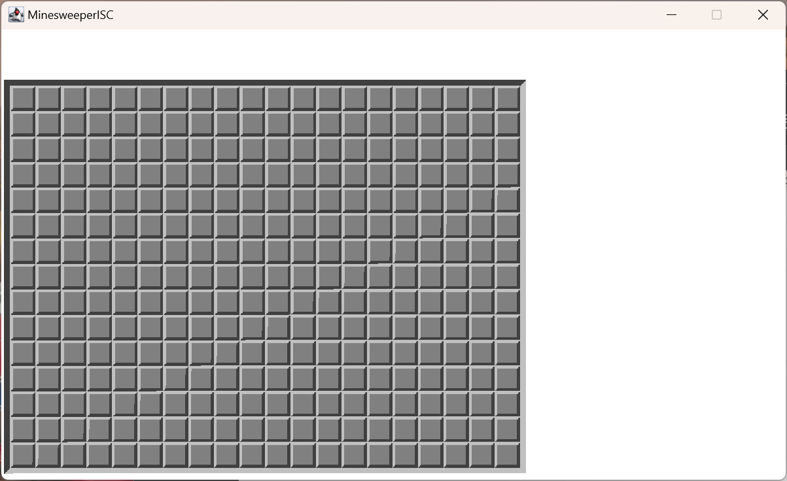
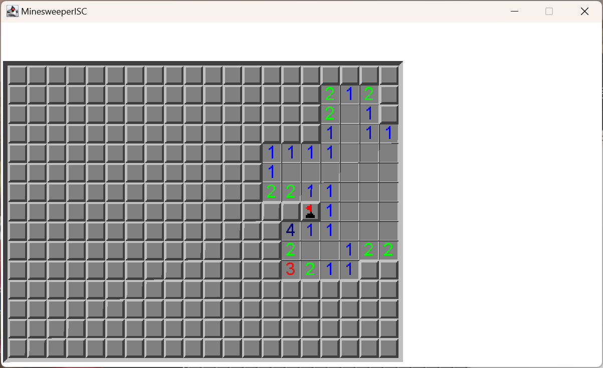

# MinesweeperISC
This project is our implementation of the classic Minesweeper game, developed as part of the 101.1 class at the HES-SO Valais Wallis. \
Developed by Lucas Henry and Gonçalo Esteves.\
The goal was to create a functional Minesweeper game with varying difficulties.

## Key features
- Choose between Beginner (10x10 grid, 10 bombs), Medium (20x15 grid, 45 bombs) or Hard (30x15 grid, 90 bombs). All these values can easily be changed in the code.
- Simple user interface. We wanted to give users a simple game with no other distractions. We didn't add unnecessary features that would take the attention away from the game.

## How to play
- Clone the repository:
```bash
git clone https://github.com/g-ae/MinesweeperISC.git
```
- Open the project with IntelliJ.
- Launch the game from the IDE, the main menu will be displayed. \

- Choose the difficulty you want by left-clicking it. The game will then start. \

- You can left-click on the tiles to check for bombs and right-click to place a flag.

- The number written in the tiles tell you how many bombs are in the 8 cases around it. If you know a bomb's position, you must place a flag on top of it. Continue discovering other empty tiles and flagging bombs until you end the game.
- Have fun !

## General idea
### Class/Object Tile
2D Array of "Tile"s (class made by us) \
Tile class would have three variables inside : 
- **Boolean**: hidden (default: true) 
- **String**: Type of tile (Bomb, Empty)
- **Boolean**: flag (is the tile flagged?)
  - *true*: user thinks a bomb is here (unclickable)
  - *false*: no flag

### Object Window
This object handles everything that concerns the window and display of information. If you want to draw a flag or bomb at a certain index, you use this object.

## FunGraphics
Version 1.5.15 \
[FunGraphics repo](https://github.com/ISC-HEI/FunGraphics/)